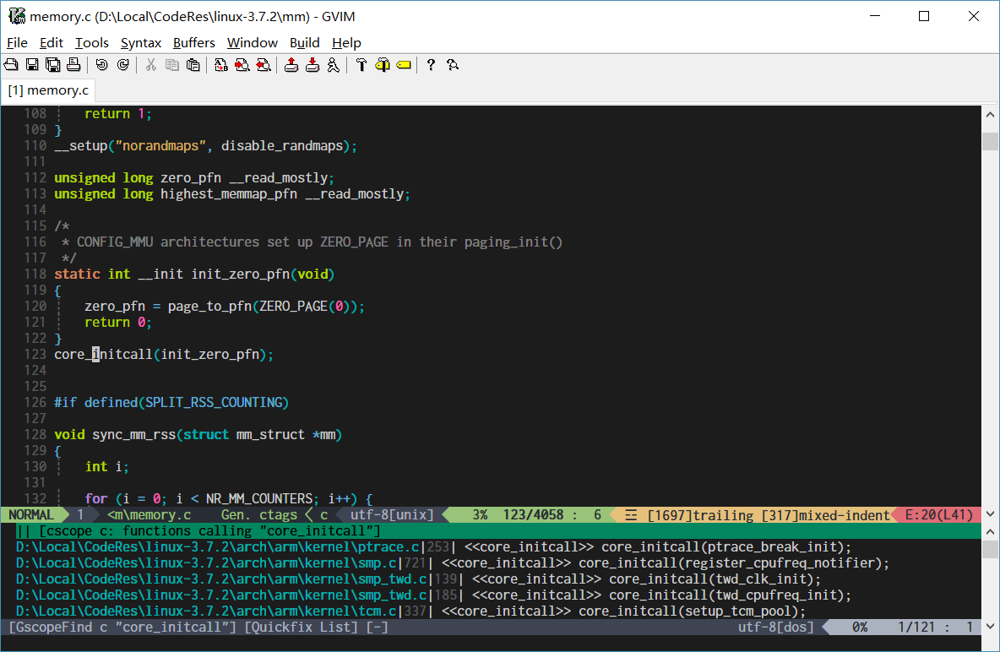

# What is it ?

[Gutentags](https://github.com/ludovicchabant/vim-gutentags) is a vim 8 dedicated plugin which will update gtags database in background automatically on file change. **Gutentags_plus** works with gutentags and provides seemless databases switching:

- Define a `GscopeFind` command to perform cscope searching via `gtags-cscope`.
- Connect gtags database of current project automatically and disconnect unrelated project databases before searching.
- Reuse gtags-cscope connection if current project is unchanged (gtags-cscope connection doesn't need a reset after updating).
- Reset gtags-cscope connection if current working directory changed (otherwise, it will get a wrong file path in quickfix).

Gutentags can connect gtags databases automatically too, but it is trying to connect all the databases after updating. As a result, when you are querying symbol definitions or references, you will get results from not only current project but also other unrelated projects. 

And your quickfix list will be totally messed up if you are working on more than two projects simultaneously. So, unrelated gtags databases must be disconnected to prevent query results from many projects at the same time.

That's the right way to use gtags. Install gutentags_plus with gutentags, you will never be worry about gtags database updating and connecting/disconnecting, you can search definitions and references whenever you want, database updating and switching are totally transparent to users, like using IDEs.


# Installation

vim-plug:

```VimL
Plug 'skywind3000/gutentags_plus'
```

vundle:

```VimL
Plugin 'skywind3000/gutentags_plus'
```

# Configuration

```VimL
Plug 'ludovicchabant/vim-gutentags'
Plug 'skywind3000/gutentags_plus'

" enable gtags module
let g:gutentags_modules = ['ctags', 'gtags_cscope']

" config project root markers.
let g:gutentags_project_root = ['.root']

" generate datebases in my cache directory, prevent gtags files polluting my project
let g:gutentags_cache_dir = expand('~/.cache/tags')

" change focus to quickfix window after search (optional).
let g:gutentags_plus_switch = 1
```

NOTE: gutentags will identify current project root by by root markers (.git/.svn/.root). if your project is not in any git/svn repository, gutentags will not generate gtags database for it. To avoid this, you can create an empty `.root` file in your project root, and gutentags will know where is your project root and generate gtags database for it.


# Demo

**Gutentags_plus** works very well when searching definition/references in huge projects like linux kernel:



Searching is very fast, You can't browse linux kernel source in IDEs, but you can read it in vim easily with the help of this plugin. 


# Command

```VimL
:GscopeFind {querytype} {name}
```

Perform a cscope search and take care of database switching before searching. 

`{querytype}` corresponds to the actual cscope line interface numbers as well as default nvi commands:

```text
0 or s: Find this symbol
1 or g: Find this definition
2 or d: Find functions called by this function
3 or c: Find functions calling this function
4 or t: Find this text string
6 or e: Find this egrep pattern
7 or f: Find this file
8 or i: Find files #including this file
9 or a: Find places where this symbol is assigned a value
```

# Keymaps

| keymap | desc |
|--------|------|
| `<leader>cs` | Find symbol (reference) under cursor |
| `<leader>cg` | Find symbol definition under cursor |
| `<leader>cd` | Functions called by this function |
| `<leader>cc` | Functions calling this function |
| `<leader>ct` | Find text string under cursor |
| `<leader>ce` | Find egrep pattern under cursor |
| `<leader>cf` | Find file name under cursor |
| `<leader>ci` | Find files #including the file name under cursor |
| `<leader>ca` | Find places where current symbol is assigned |
| `<leader>cz` | Find current word in ctags database |

You can disable the default keymaps by:

```VimL
let g:gutentags_plus_nomap = 1
```

and define your new maps like:

```VimL
noremap <silent> <leader>gs :GscopeFind s <C-R><C-W><cr>
noremap <silent> <leader>gg :GscopeFind g <C-R><C-W><cr>
noremap <silent> <leader>gc :GscopeFind c <C-R><C-W><cr>
noremap <silent> <leader>gt :GscopeFind t <C-R><C-W><cr>
noremap <silent> <leader>ge :GscopeFind e <C-R><C-W><cr>
noremap <silent> <leader>gf :GscopeFind f <C-R>=expand("<cfile>")<cr><cr>
noremap <silent> <leader>gi :GscopeFind i <C-R>=expand("<cfile>")<cr><cr>
noremap <silent> <leader>gd :GscopeFind d <C-R><C-W><cr>
noremap <silent> <leader>ga :GscopeFind a <C-R><C-W><cr>
noremap <silent> <leader>gz :GscopeFind z <C-R><C-W><cr>
```

# Troubleshooting

### ERROR: gutentags: gtags-cscope job failed, returned: 1

step1: add the line below to your `.vimrc`:

    let g:gutentags_define_advanced_commands = 1

step2: restart vim and execute command:

    :GutentagsToggleTrace

step3: open some files and generate gtags again with current project:

    :GutentagsUpdate

step4: you may see a lot of gutentags logs, after that:

    :messages

To see the gtags log.


# Credits

You may be interested in the [vim-preview](https://github.com/skywind3000/vim-preview) plugin, it can preview results from quickfix window when you press `p`.

